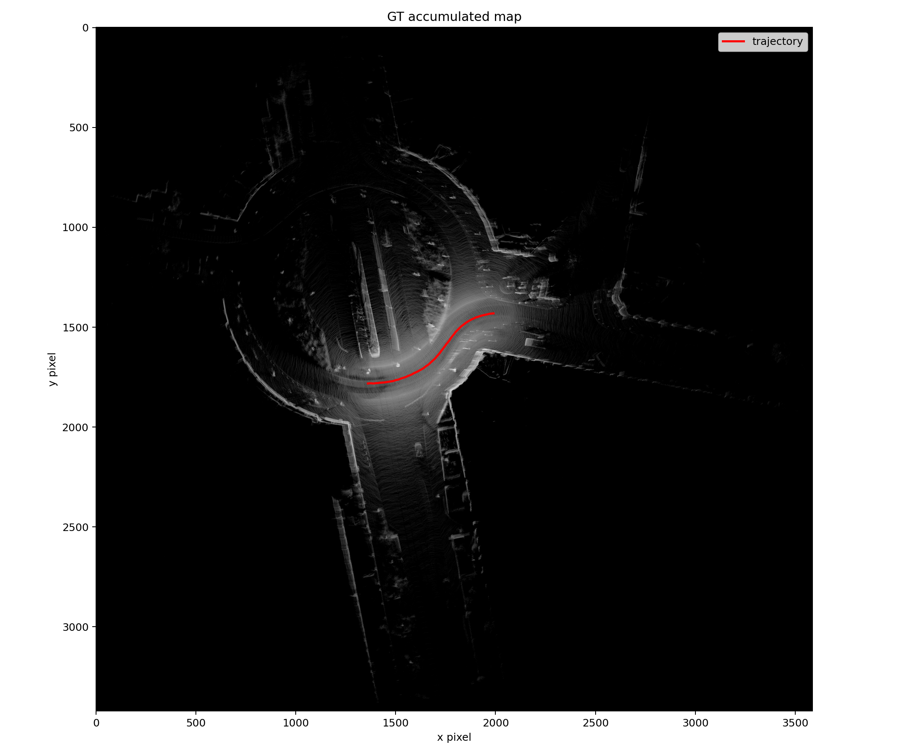
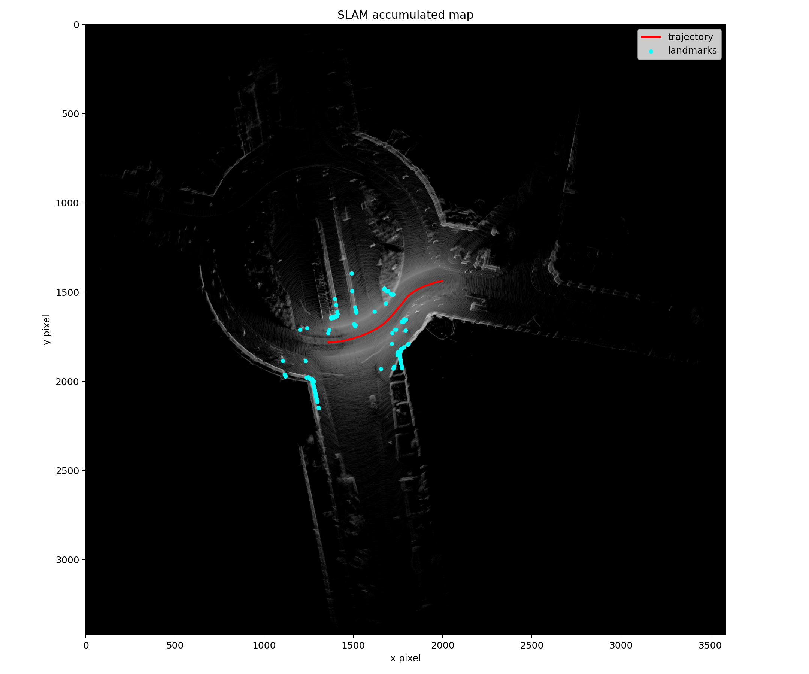
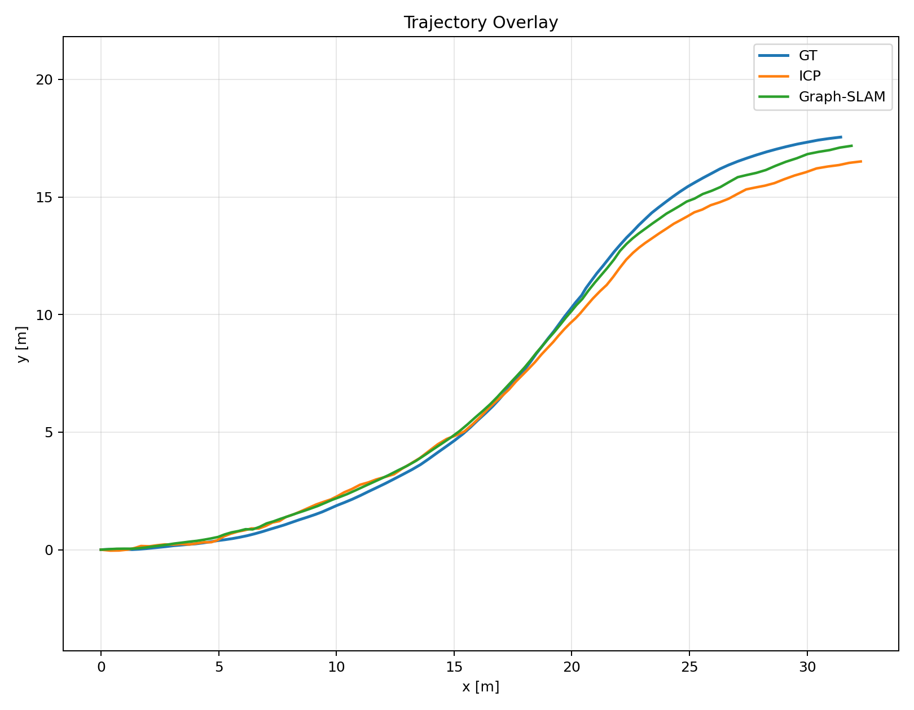
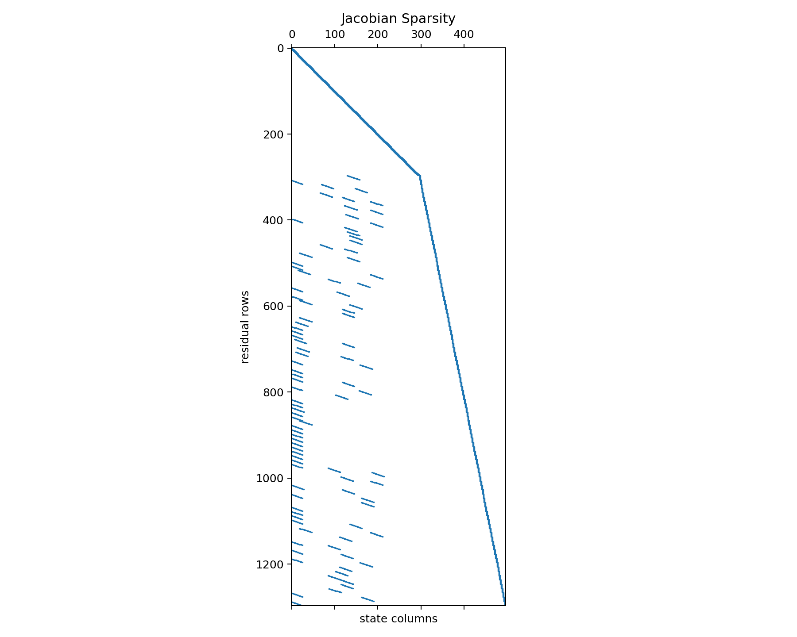
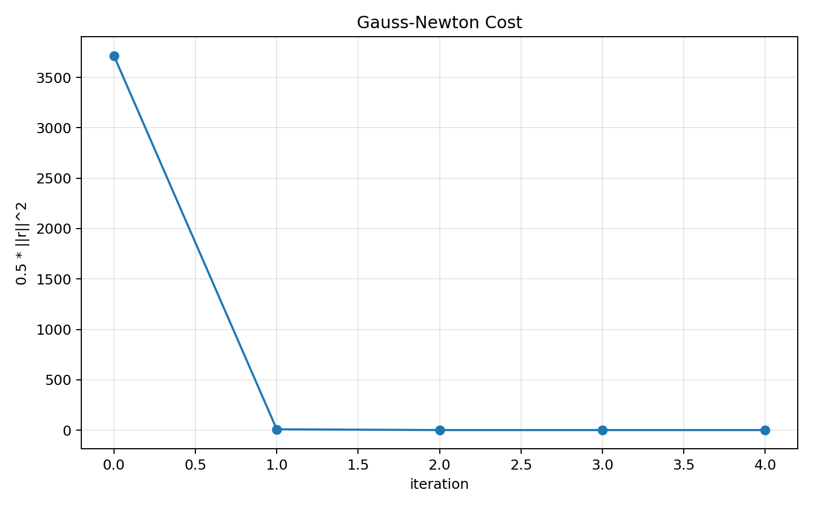

# CS588 KITTI Static Mapping + ICP + Graph-SLAM

## Dataset

- Sequence: `2011_09_26_drive_0005_sync`
- Frames used: `100` (`0` to `99`)
- Mean static points per frame: `121454.5`
- Mean dynamic-point ratio: `0.0134`
- Final landmarks: `100`

## Parameters

- Map resolution: `0.05 m/pixel`
- ICP voxel size: `0.25 m`
- ICP max correspondence: `1.50 m`
- ICP iterations: `60`
- Graph-SLAM sigmas: `sigma_xy=0.24`, `sigma_theta=0.04`, `sigma_d=0.08`
- Gauss-Newton iterations: `50`
- Gauss-Newton damping: `1e-06`

## Metrics
- ICP ATE RMSE: `0.6786` m
- Graph-SLAM ATE RMSE: `0.3440` m

## Figures

